# AegisFX System Architecture

This document presents the complete AegisFX architecture as built to date. The diagram below shows the major layers of the system and how data flows between them, from external data sources through AI analysis, deterministic safety gates, broker execution, persistence, and finally to the operator dashboard and investor reporting.

---

## System Architecture Diagram

```mermaid
flowchart TD
    %% ============ External Data Sources ============
    subgraph DATA["1. External Data Sources"]
        AV[Alpha Vantage<br/>FX Market Data]
        OANDA_IN[OANDA<br/>Broker State / Prices]
        OAI[OpenAI API<br/>Market Analysis]
    end

    %% ============ Market Data Layer ============
    subgraph MKT["2. Market Data Layer"]
        PriceFeed[Alpha Vantage<br/>Price Feed]
        CtxBuilder[Market Context<br/>Builder]
        Trend[Trend<br/>Calculation]
        Vol[Volatility<br/>Calculation]
        RangePct[Range Percentile /<br/>Position-in-Range]
    end

    %% ============ AI Intelligence Layer ============
    subgraph AI["3. AI Intelligence Layer"]
        MAS[OpenAI Market<br/>Analysis Service]
        Regime[Regime<br/>Classification]
        StratRec[Strategy<br/>Recommendation Service]
        PropSvc[Trade Proposal<br/>Service]
        ApprQueue[Proposal Approval<br/>Queue]
        AccAnalytics[Recommendation<br/>Accuracy Analytics]
        AttrAnalytics[Strategy Attribution<br/>Analytics]
    end

    %% ============ Execution & Safety Layer ============
    subgraph EXEC["4. Execution and Safety Layer"]
        Orch[Trade<br/>Orchestrator]
        Idem[Idempotency<br/>Check]
        Crash[Crash<br/>Recovery]
        Rate[Rate<br/>Limiter]
        CB[Circuit<br/>Breaker]
        Risk[Portfolio<br/>Risk Evaluator]
        Net[Position<br/>Netting]
        Health[Broker Health<br/>Monitor]
        Toggle[Trading<br/>ON/OFF Control]
    end

    %% ============ Broker Integration ============
    subgraph BROKER["5. Broker Integration"]
        OandaBr[OANDA Broker<br/>Client]
        MarketOrder[Market Order<br/>Execution]
        Close[Position<br/>Close]
        BrkStatus[Order Status /<br/>Health]
    end

    %% ============ Persistence Layer ============
    subgraph PERSIST["6. Persistence Layer (SQLite)"]
        TradesDB[(Trade State<br/>Database)]
        AIDB[(AI Analysis<br/>History DB)]
        PropDB[(Proposal Approval<br/>Database)]
        RegimeDB[(Regime Transition<br/>Database)]
    end

    %% ============ Dashboard / Operator Layer ============
    subgraph DASH["7. Dashboard / Operator Layer (Streamlit)"]
        PnL[P&L Panel]
        Daily[Daily Performance<br/>Table]
        Equity[Equity Curve]
        Positions[Current Positions]
        RiskUI[Risk Exposure]
        AIAgree[AI Agreement]
        Proposals[AI Trade Proposals]
        ApprUI[Approval Queue<br/>UI]
        Alerts[Alerts /<br/>System Status]
        ReportUI[Investor Report<br/>Export]
    end

    %% ============ Reporting / Investor Layer ============
    subgraph REPORT["8. Reporting / Investor Layer"]
        CSV[CSV Export]
        HTMLR[HTML / PDF-Style<br/>Investor Report]
        Consistency[Daily Consistency<br/>Metrics]
        PropAn[AI Proposal<br/>Analytics]
        Attr[Strategy<br/>Attribution]
        Acc[Recommendation<br/>Accuracy]
    end

    %% ============ External Outputs ============
    subgraph OUT["9. External Outputs"]
        DemoUI[Demo Dashboard<br/>for Operator]
        InvDoc[Investor Report<br/>Document]
        OpDec[Operator<br/>Decisions]
        BrokerTrades[Real Broker Trades<br/>on OANDA Demo]
    end

    %% ============ Flows: Data Sources -> Market Data ============
    AV --> PriceFeed
    PriceFeed --> CtxBuilder
    CtxBuilder --> Trend
    CtxBuilder --> Vol
    CtxBuilder --> RangePct

    %% ============ Flows: Market Data -> AI ============
    Trend --> MAS
    Vol --> MAS
    RangePct --> MAS
    OAI --> MAS
    MAS --> Regime
    Regime --> StratRec
    RangePct --> StratRec
    StratRec --> PropSvc
    PropSvc --> ApprQueue

    %% ============ Flows: Approval -> Execution ============
    ApprQueue -->|Operator Approves| OpDec
    OpDec -->|Manual Execute Click| Orch

    %% ============ Flows: Orchestrator Gates ============
    Orch --> Idem
    Orch --> Crash
    Orch --> Rate
    Orch --> CB
    Orch --> Net
    Orch --> Risk
    Orch --> Health
    Orch --> Toggle

    %% ============ Flows: Orchestrator -> Broker ============
    Orch -->|Approved Trade| OandaBr
    OandaBr --> MarketOrder
    OandaBr --> Close
    OandaBr --> BrkStatus
    MarketOrder --> BrokerTrades

    %% ============ Flows: Broker -> Health -> Alerts ============
    BrkStatus --> Health
    Health --> Alerts
    OANDA_IN --> OandaBr

    %% ============ Flows: Execution -> Persistence ============
    Orch --> TradesDB
    MAS --> AIDB
    Regime --> RegimeDB
    PropSvc --> PropDB
    ApprQueue --> PropDB

    %% ============ Flows: Persistence -> Dashboard ============
    TradesDB --> PnL
    TradesDB --> Daily
    TradesDB --> Equity
    TradesDB --> Positions
    TradesDB --> RiskUI
    AIDB --> AIAgree
    PropDB --> Proposals
    PropDB --> ApprUI
    PropDB --> Acc
    PropDB --> Attr
    RegimeDB --> Alerts

    %% ============ Flows: Persistence -> Analytics ============
    TradesDB --> AccAnalytics
    PropDB --> AccAnalytics
    TradesDB --> AttrAnalytics
    PropDB --> AttrAnalytics
    AIDB --> AttrAnalytics

    %% ============ Flows: Analytics -> Reports ============
    AccAnalytics --> Acc
    AttrAnalytics --> Attr
    TradesDB --> Consistency
    PropDB --> PropAn

    %% ============ Flows: Reports -> Investor Layer ============
    Consistency --> CSV
    PropAn --> CSV
    Attr --> CSV
    Acc --> CSV
    Consistency --> HTMLR
    PropAn --> HTMLR
    Attr --> HTMLR
    Acc --> HTMLR

    %% ============ Flows: Dashboard / Reports -> Outputs ============
    ReportUI --> CSV
    ReportUI --> HTMLR
    PnL --> DemoUI
    Daily --> DemoUI
    Equity --> DemoUI
    Positions --> DemoUI
    RiskUI --> DemoUI
    AIAgree --> DemoUI
    Proposals --> DemoUI
    ApprUI --> DemoUI
    Alerts --> DemoUI
    CSV --> InvDoc
    HTMLR --> InvDoc

    %% ============ Styling ============
    classDef sourceCls fill:#dbe9ff,stroke:#1d4ed8,color:#0f172a
    classDef marketCls fill:#e0f2fe,stroke:#0369a1,color:#0f172a
    classDef aiCls fill:#fce7f3,stroke:#be185d,color:#0f172a
    classDef execCls fill:#fef3c7,stroke:#b45309,color:#0f172a
    classDef brokerCls fill:#ffedd5,stroke:#9a3412,color:#0f172a
    classDef persistCls fill:#e5e7eb,stroke:#374151,color:#0f172a
    classDef dashCls fill:#dcfce7,stroke:#15803d,color:#0f172a
    classDef reportCls fill:#ede9fe,stroke:#6d28d9,color:#0f172a
    classDef outCls fill:#fef2f2,stroke:#b91c1c,color:#0f172a

    class AV,OANDA_IN,OAI sourceCls
    class PriceFeed,CtxBuilder,Trend,Vol,RangePct marketCls
    class MAS,Regime,StratRec,PropSvc,ApprQueue,AccAnalytics,AttrAnalytics aiCls
    class Orch,Idem,Crash,Rate,CB,Risk,Net,Health,Toggle execCls
    class OandaBr,MarketOrder,Close,BrkStatus brokerCls
    class TradesDB,AIDB,PropDB,RegimeDB persistCls
    class PnL,Daily,Equity,Positions,RiskUI,AIAgree,Proposals,ApprUI,Alerts,ReportUI dashCls
    class CSV,HTMLR,Consistency,PropAn,Attr,Acc reportCls
    class DemoUI,InvDoc,OpDec,BrokerTrades outCls
```

---

## How To Read This Diagram

AegisFX is a layered system. Data flows top-to-bottom from raw external sources, through analysis and safety layers, to final execution and reporting. The dashboard layer sits on top of the persistence layer and shows the operator everything the system is doing in real time.

### Plain-English Walkthrough

The system starts at the top with three external sources: **Alpha Vantage** provides live forex price candles, **OpenAI** provides market interpretation, and **OANDA** is the actual broker where real demo trades are placed.

The **Market Data Layer** takes raw Alpha Vantage candles and computes meaningful signals from them — current price, recent trend direction, volatility, and where the current price sits within the recent trading range (top of range, middle, or bottom).

The **AI Intelligence Layer** sends this market context to OpenAI, which classifies the market regime (Trending, Ranging, Volatile, Risk-On, Risk-Off). A deterministic strategy recommendation engine then converts this AI output into a structured trade bias (LONG, SHORT, or NEUTRAL) using fixed rules. From those rules, a trade proposal service produces concrete trade ideas and places them into an approval queue for the operator to review.

Crucially, **no AI trade ever executes automatically**. The operator must manually approve a proposal, then manually click "Execute" to send it forward.

When the operator does execute an approved proposal, the **Execution and Safety Layer** runs the request through multiple deterministic gates before it ever reaches the broker: idempotency check, crash recovery, rate limit, circuit breaker, position netting, portfolio risk evaluator, broker health, and trading on/off control. Any one of these can block a trade.

If the trade passes all gates, the **Broker Integration Layer** sends a real market order to OANDA's demo account. OANDA's response (filled, rejected, cancelled) flows back into the system.

Every meaningful event — AI analyses, regime changes, proposals, approvals, executions, trades, closes — is persisted to **SQLite databases**. This is the single source of truth for the dashboard and all reporting.

The **Dashboard / Operator Layer** reads from these databases and renders the live operational view: P&L, equity curve, current positions, risk exposure, AI agreement status, the approval queue, system alerts, and report exports.

Finally, the **Reporting / Investor Layer** aggregates closed-trade data into investor-grade outputs: daily consistency tables, proposal analytics, strategy attribution by regime, and AI recommendation accuracy. These can be exported as CSV or as a print-ready HTML report.

The **External Outputs** at the bottom are the things stakeholders actually see: the live demo dashboard, the investor report document, the operator's decision trail, and the real broker trades on OANDA.

---

## Key Flows In Short

1. **Signal generation:** Alpha Vantage → Market Context → OpenAI Analysis → Strategy Recommendation → Trade Proposal
2. **Human approval:** Trade Proposal → Approval Queue → Manual Operator Decision
3. **Execution path:** Manual Execute → Trade Orchestrator → Safety Gates → OANDA Broker
4. **State persistence:** Execution Results → SQLite Trade State → Dashboard & Reports
5. **AI auditability:** AI Results → AI History → Confidence Trend & Regime Changes
6. **Health surfacing:** Broker Health → Alerts Panel & Execution Guard
